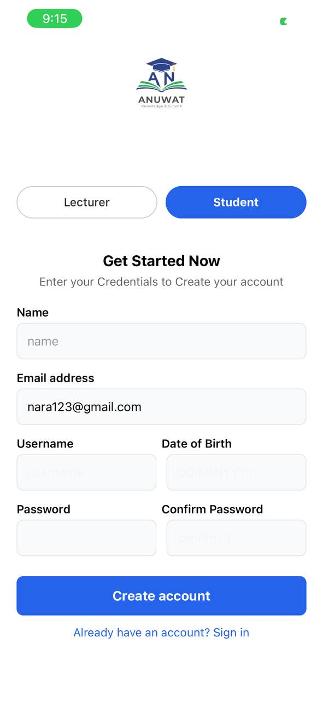
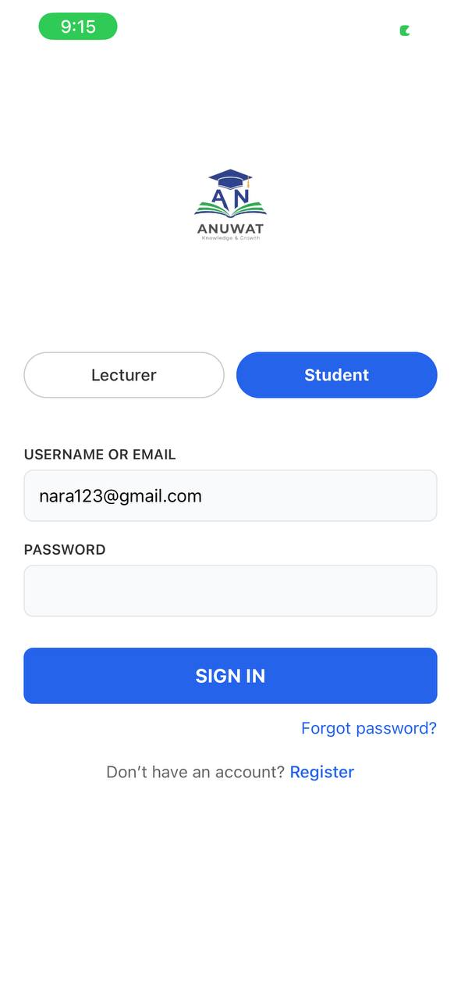
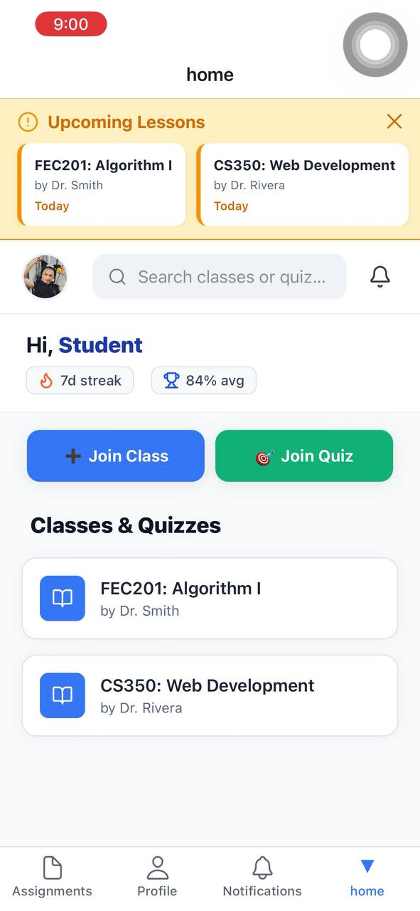
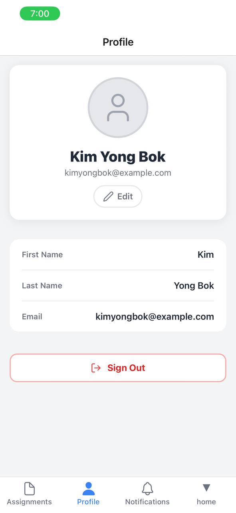
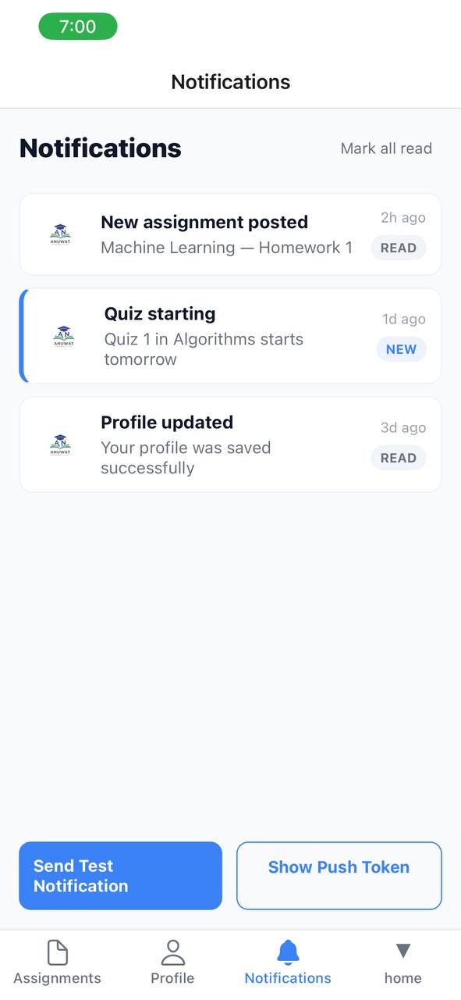

# Classroom & Quiz App (Expo)

One-stop demo app for classroom and quiz workflows built with Expo Router and React Native.

## Quick Start
- **Install dependencies:** `npm install`
- **Start Metro / Dev tools:** `npx expo start`
- Open in **Expo Go** or emulator from the Expo dev tools.

## Development Notes
- **Routing:** File-based routing under the `app/` folder (uses `expo-router`).
- **Main tabs:** `app/(tabs)/index.jsx` (Home), `app/(tabs)/assignment.jsx` (Assignments / Quizzes), `app/(tabs)/notifications.jsx`, `app/(tabs)/profile.jsx`.
- **Class page:** `app/class.jsx` shows class details and includes a `Leave` action.
- **Join flows:** `app/joinClass.jsx` and `app/joinQuiz.jsx` — joining persists to `AsyncStorage` via `utils/storage.js`.

## 🤖 AI-Assisted Development
During development, AI tools (e.g., LLMs like Claude, GitHub Copilot) were used **responsibly** to:
- ✅ **Debug setup & runtime issues** — e.g., identifying missing dependencies, Expo config mismatches, or AsyncStorage syntax errors.
- ✅ **Refine UI/UX consistency** — improving spacing, alignment, typography, and responsive behavior across screens (e.g., centering action text, standardizing button styles).
- ✅ **Review code structure** — suggesting clearer component patterns or more idiomatic React Native practices.

> 🔒 **Note**: All core logic (quiz flow, class management, streak tracking), architecture decisions, and final implementation were developed and verified by the author. AI served strictly as a productivity and quality-assurance aid — not a replacement for understanding or ownership.

## App Screenshots

### 1. Login / Sign Up Screen

> Student/Lecturer role selection, credential input, and account creation flow.

---

### 2. Home Dashboard

> Personalized greeting, streak & avg stats, quick join buttons, and enrolled classes/quizzes list.

---

### 3. Profile Page

> User info display, edit option, and sign-out button.

---

### 4. Assignment

---

### 4. Notification

> Timestamped notifications with status badges (“NEW”, “READ”), and test/push token utilities.
## Notifications
- Local notifications are stored in `AsyncStorage` under the key `local_notifications_v1` and rendered in `app/(tabs)/notifications.jsx`.
- When a student joins a class or a quiz the app:
   - Adds a notification entry to `local_notifications_v1`.
   - Schedules a short local notification using `expo-notifications` for immediate feedback.
- To view or copy the push token: open the Notifications tab and press the `Token` action (copies to clipboard).

## Timed Quiz (Planned / How it works)
- The app contains join + start quiz flows (`app/joinQuiz.jsx`).
- You requested a timed quiz (10–15 questions, 10 seconds each). If you want this implemented now I can:
   1. Add a quiz screen at `app/quiz.jsx` that accepts `quizId` and starts a timer.
   2. Provide mock questions and handle per-question 10s timers, scoring, and result screen.

## Storage helpers
- `utils/storage.js` exposes helpers: `getJoinedClasses`, `joinClass`, `leaveClass`, `getJoinedQuizzes`, `joinQuiz`, `exitQuiz`. These use `@react-native-async-storage/async-storage`.

## Run & Test Tips
- To reset cached Metro/Expo state: `npx expo start -c`.
- Notifications: on-device behavior varies by platform and emulator. For reliable notifications, test on a physical device or development build with proper permissions.
- Push token: stored under `push_token` in `AsyncStorage` after registering for push notifications (the Profile screen usually triggers registration).

## File structure (high level)
- `app/` — screens and routes
- `components/` — reusable UI components
- `utils/` — helpers including `storage.js`
- `service/` — third-party service configs (e.g., Appwrite)

## Next steps I can do for you
- Implement the timed quiz flow (10–15 questions, 10s each) and a results screen.
- Show relative times for notifications (e.g., "2m ago").
- Replace Alerts with an in-app toast/snackbar for smoother UX.